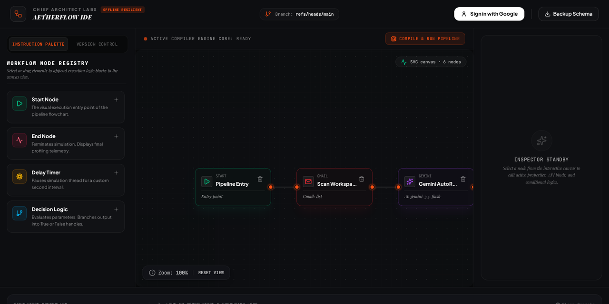
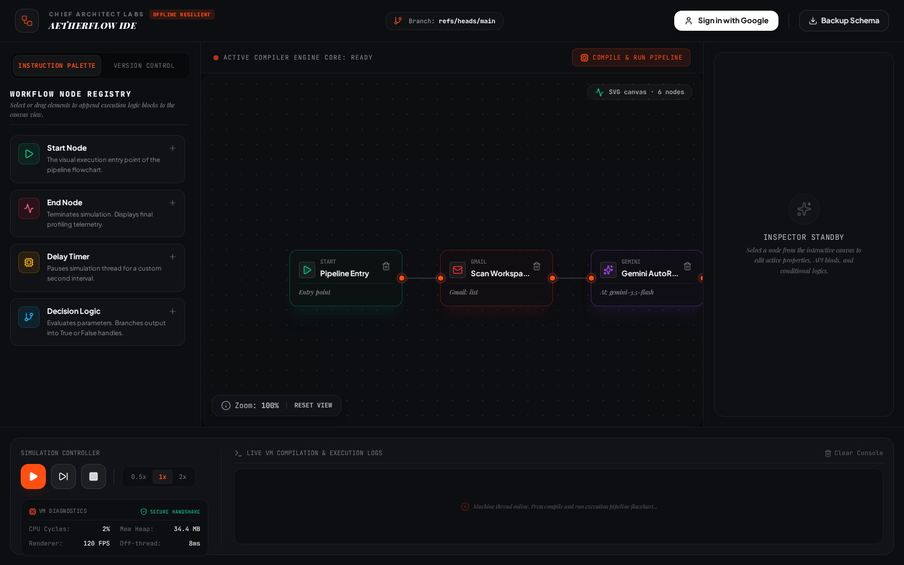
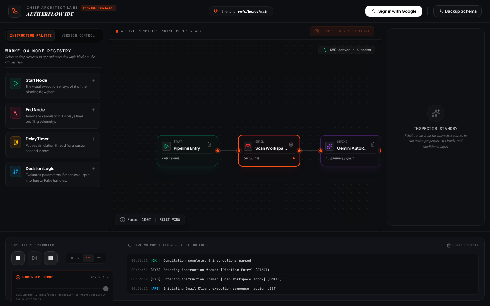
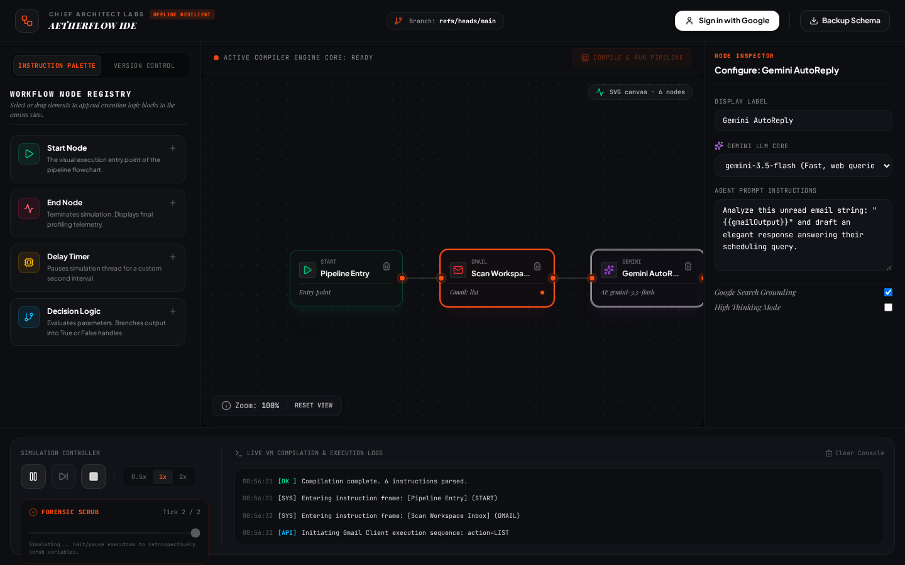
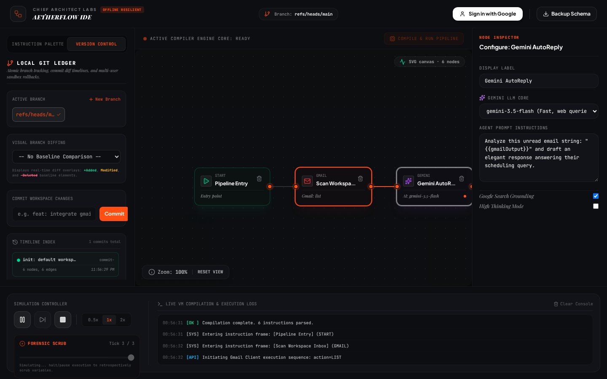

# AetherFlow

Local-first visual flowchart IDE. Drag nodes onto a custom pan/zoom canvas, compile the graph, and run a step simulator with time-travel snapshots.

[](https://aetherflow-ide.vercel.app)
[](https://github.com/devtechedge/aether-flow/actions/workflows/ci.yml)
[](https://react.dev/)
[](https://vitejs.dev/)
[](https://www.typescriptlang.org/)
[](https://tailwindcss.com/)
[](LICENSE)

---

## Live Demo

**https://aetherflow-ide.vercel.app**

Do **not** use https://aether-flow.vercel.app - that hostname is paused and is not this project.

> **Status:** The live site is a **client-side demo**. Graphs persist in `localStorage`. Sign in with Google to link Gmail / Drive / Docs; unsigned runs use mock Workspace payloads. Gemini calls hit `/api/gemini/generate` and fall back to a canned reply when `GEMINI_API_KEY` is unset.

This is the **only** public repo for the project.

---

## Screenshots

<p align="center">
  
</p>

| Canvas | Run |
|--------|-----|
|  |  |

| Inspector | Version control |
|-----------|-----------------|
|  |  |

---

## Features

- Custom SVG canvas (no React Flow / GoJS) with pan, wheel-zoom, 8px snap, and cubic-bezier links
- Quadtree viewport culling so off-screen cards skip DOM work
- Node palette: Start, End, Delay, Logic, Gmail, Drive, Docs, Gemini
- Graph compiler: start/end checks, dangling edges, self-loop reject
- Step simulator with VCR controls and snapshot scrubber
- Local branch / commit ledger on `localStorage` plus a visual added / modified / ghost-deleted overlay
- Optional Gemini proxy and Google Workspace nodes. Sign in with Google on the live demo to use your inbox, Drive, and Docs; unsigned runs stay on mock payloads.

---

## Tech Stack

| Layer | Technology |
|-------|------------|
| Frontend | React 19, Vite 6, TypeScript, Tailwind 4 |
| Canvas | SVG + DOM cards, quadtree cull |
| Persistence | `localStorage` (not IndexedDB) |
| Auth | Firebase Google popup on the live demo. Workspace scopes requested at sign-in. Unsigned runs stay mock. |
| AI | Optional `POST /api/gemini/generate` (Gemini 2.5). Mock fallback on Vercel |
| Local server | Express + Vite middleware (`tsx server.ts`) |
| Hosting | Vercel (static Vite + serverless `/api`) |
| CI | GitHub Actions - Vitest, `tsc`, Playwright |

---

## Quick Start

```bash
git clone https://github.com/devtechedge/aether-flow.git
cd aether-flow
npm install
cp .env.example .env
npm run dev
```

Open **http://localhost:3000**. Google sign-in works on localhost. Gemini is optional - the default pipeline runs on mock data without a key.

```bash
npm test
npm run typecheck
npx playwright install chromium
npm run test:e2e
```

---

## Security

Portfolio demo: Google sign-in is available on the public site. Graphs stay in the visitor's `localStorage`. Logic nodes evaluate short expressions with `Function` in the visitor's own browser. The Gemini key, when present, stays on the server.

Details: **[SECURITY.md](SECURITY.md)**.

---

## License

MIT. See [LICENSE](LICENSE).
